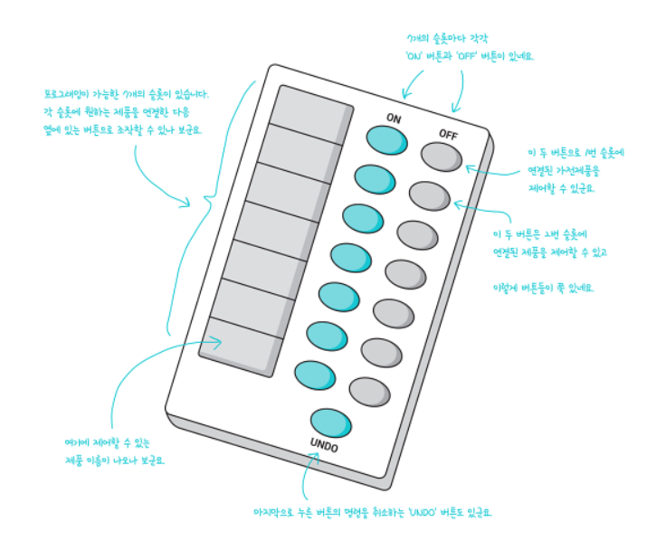
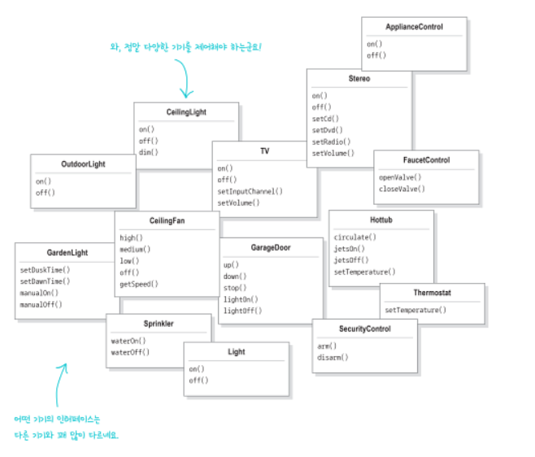

# 커맨드 패턴

만약 만능 리모컨을 만든다면?

- 연결되어있는 기기들은 공통된 인터페이스가 없고 전부 다르게 생겼다

##기존 
- 1번 버튼을 눌렀을 때 TV를 킨다
- 2번 버튼을 눌렀을 때 전등을 킨다
- ...
> 리모컨 기능을 변경하거나 새로운 기기가 추가될 때마다 수정이 크고 변경이 생길 일이 많다

##개선

> 리모컨과 기기 사이에 `커맨드 객체`를 두어서 리모컨이 기기에 대해 알지 못해도 된다 

## 예시
1. 고객이 주문서를 작성해 종업원에게 전달  `createOrder()`
2. 종업원이 주문서를 주방에 전달 `takeOrder()`, `orderUp()`
3. 주방장은 주문대로 음식을 준비 `makeBurger()`, `makeShake()`

주방장은 고객에 대해 알지 못해도 주문서대로만 요리를 하면 됨

> - 고객 = 클라이언트 객체
> - 주문서 = 커맨드 객체
> - 종업원 = 인보커 객체
> - `orderUp()` = `execute()`
> - 주방장 = 리시버 객체
> - `takeOrder()` = `setCommand()`
