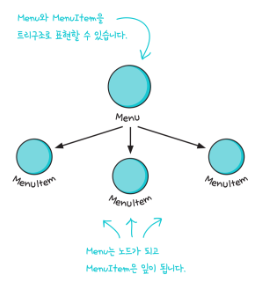
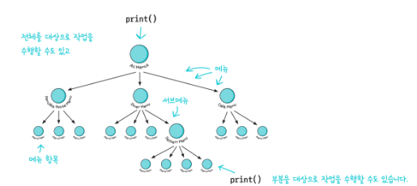

# Chapter9 반복자 패턴과 컴포지트 패턴

**컬렉션 잘 관리하기**
  

## 클라이언트가 컬렉션에 들어있는 모든 객체에서 일일이 접근하고 싶어지면?
- A는 ArrayList, B는 배열 등..., 각기 다른 형태일 것이다.
-  객체들을 어떤 식으로 저장했는지 전부 알 필요가 없다!

### 예시

1. A 레스토랑에서는 메뉴를 ArrayList에 저장한다
2. B 레스토랑에서는 메뉴를 배열에 저장한다
3. 아침에는 A 레스토랑의 아침메뉴, 점심에는 B레스토랑의 점심 메뉴를 제공하도록 합병하려면 어떻게 해야하지?

### 모든 메뉴를 순환하기
A 레스토랑
```java
for (int i=0; i < breakfastItems.size(); i++) {
	MenuItem menuitem = breakfastItems.get(i)
;}
```
B 레스토랑
```java
for (int i=0; i < lunchItems.length; i++) {
	MenuItem menuItem = lunchItems[i];
}
```
-> 인터페이스를 통합해야 한다

## 반복자 패턴
```java
Iteratior iterator = breakfastMenu.createIterator();
while (iterator.hasNext()) {
	MenuItem menuItem = iterator.next()
}
```
```java
Iteratior iterator = lunchMenu.createIterator();
while (iterator.hasNext()) {
	MenuItem menuItem = iterator.next()
}
```

## 즉 바뀌는 부분을 캡슐화 하라
=> 반복 작업을 캡슐화하라
=> **반복자 패턴**


---

## 컴포지트 패턴
> 객체를 트리구조로 구성해서 부분-전체 계층구조를 구현한다. 
> 클라이언트에서 개별 객체와 복합 객체를 똑같은 방법으로 다룰 수 있다.

부분-전체 계층구조 
- 부분(메뉴 및 메뉴 항목)들이 계층을 이루고 있지만 모든 부분을 묶어서 전체로 다룰 수 있는 구조


메뉴 관리에 도움이 되는 컴포지트 패턴을 추가로 쓰기

=> 간단한 코드만 가지고 똑같은 작업을 전체 메뉴 구조를 대 상으로 반복해서 적용 가능

